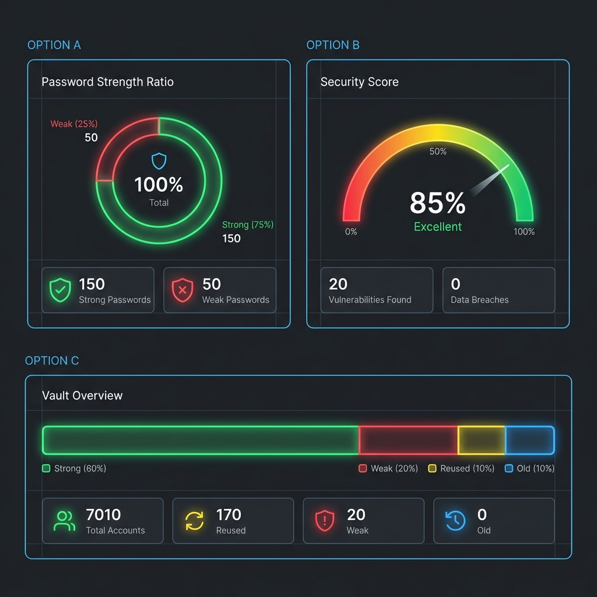

# Password Manager (Projekt Grupowy)

Aplikacja desktopowa do bezpiecznego zarządzania hasłami, stworzona przy użyciu Python i PyQt5.

## Przegląd

Projekt ma na celu dostarczenie użytkownikom bezpiecznego i intuicyjnego narzędzia do przechowywania haseł. Aplikacja oferuje nowoczesny interfejs użytkownika (Dark Mode), analizę siły haseł oraz kategoryzację wpisów.


*(Powyżej: Koncept panelu bezpieczeństwa)*

## Funkcjonalności

*   **Bezpieczne logowanie:** Panel dostępu chroniony hasłem głównym.
*   **Zarządzanie hasłami:** Dodawanie, przeglądanie i edycja haseł.
*   **Analiza bezpieczeństwa:**
    *   Wizualny wskaźnik siły hasła (Security Score).
    *   Wykrywanie słabych i powtarzających się haseł.
    *   Estymacja czasu potrzebnego na złamanie hasła.
*   **Ulubione:** Możliwość oznaczania najważniejszych kont gwiazdką.
*   **Nowoczesny Sidebar:** Intuicyjna nawigacja z licznikami powiadomień.

## Instalacja i Uruchomienie

1.  **Wymagania:**
    *   Python 3.8+
    *   Biblioteki z pliku `requirements.txt` (głównie `PyQt5`, `zxcvbn`).

2.  **Instalacja zależności:**
    ```bash
    pip install PyQt5 zxcvbn
    ```

3.  **Uruchomienie:**
    Przejdź do katalogu projektu i uruchom plik główny:
    ```bash
    python Project/src/main.py
    ```

## Struktura Projektu

*   **src/** - Kod źródłowy aplikacji (interfejs, logika).
*   **config/** - Pliki konfiguracyjne.
*   **data/** - Lokalne pliki danych (hasła).
*   **assets/** - Grafiki i zasoby wizualne.

## Status Rozwoju

Projekt jest w fazie aktywnego rozwoju.
*   **Zrobione:** Podstawowy interfejs, nawigacja, dashboard bezpieczeństwa.
*   **W planach:** Implementacja sekcji Vault, Settings i Profile, poprawki UI.
