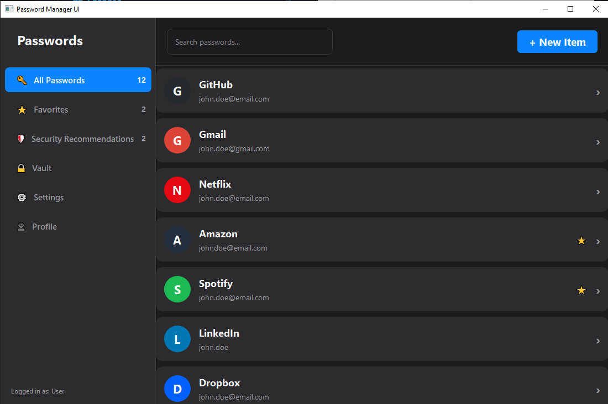
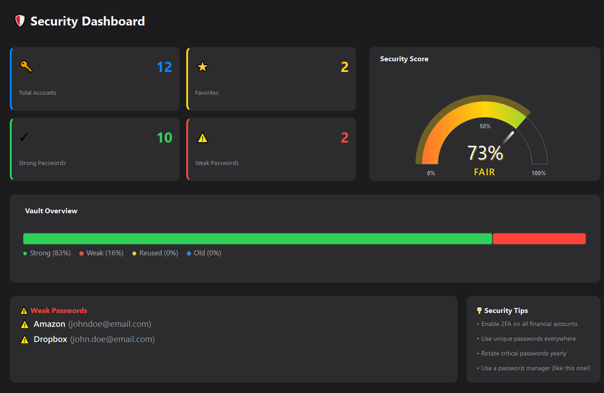
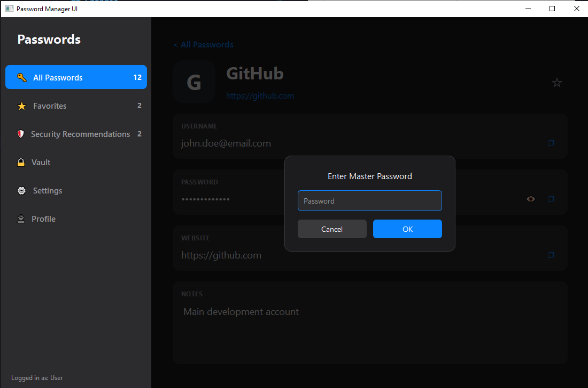

# Password Manager (Projekt Grupowy)

Aplikacja do bezpiecznego zarządzania hasłami napisana w Pythonie z użyciem biblioteki PyQt5.

## O projekcie

Program pozwala bezpiecznie przechowywać dane logowania do różnych serwisów. Interfejs jest prosty i czytelny, a dodatkowe narzędzia pomagają zadbać o silne hasła.

### Widok główny


### Panel bezpieczeństwa


### Szczegóły i kopiowanie


## Główne funkcje

* Logowanie hasłem głównym do aplikacji.
* Przechowywanie haseł w lokalnej bazie.
* Analiza siły haseł i informacja o czasie potrzebnym na ich złamanie.
* Możliwość dodawania haseł do ulubionych.
* Wygodne kopiowanie haseł jednym przyciskiem.

## Jak uruchomić projekt

1. Musisz mieć zainstalowanego Pythona (wersja 3.8 lub nowsza).
2. Zainstaluj potrzebne biblioteki komendą:
   ```bash
   pip install PyQt5 zxcvbn
   ```
3. Uruchom program wpisując:
   ```bash
   python Project/src/main.py
   ```

## Budowa folderów

* src: tutaj jest cały kod programu.
* config: pliki z ustawieniami.
* data: tutaj trzymane są Twoje hasła.
* assets: grafiki używane w aplikacji.

## Co dalej

Obecnie pracujemy nad dodaniem pełnej obsługi profilu użytkownika, ustawień aplikacji oraz bezpiecznego schowka (Vault).